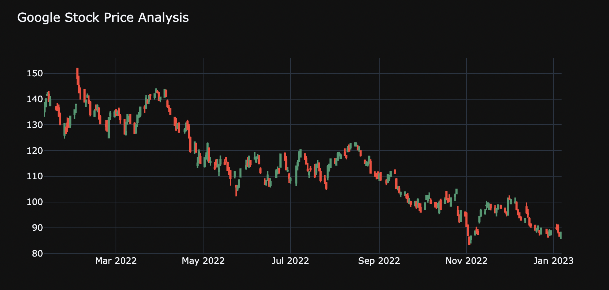
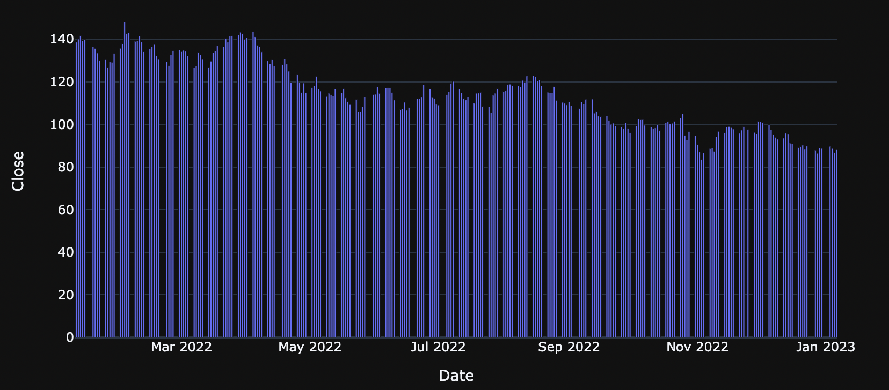
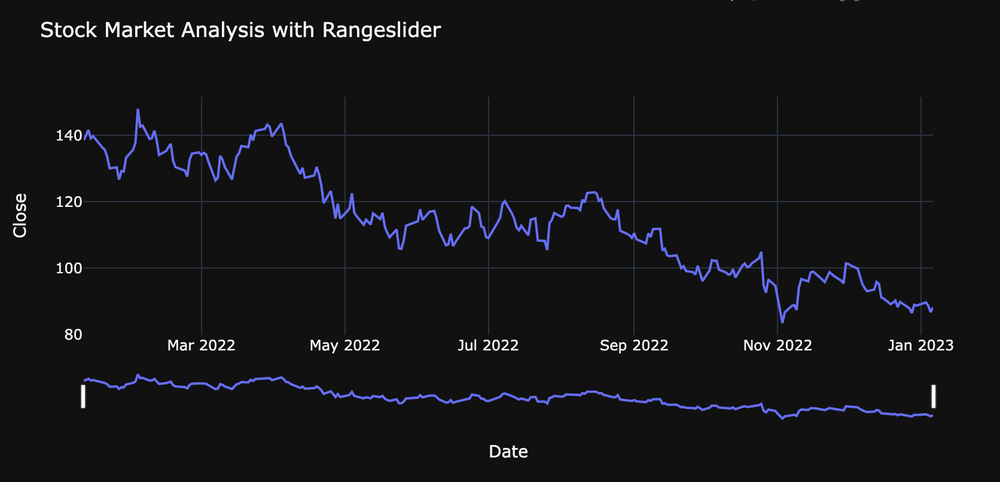
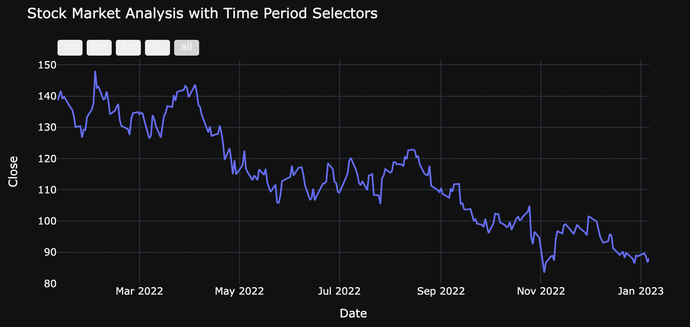
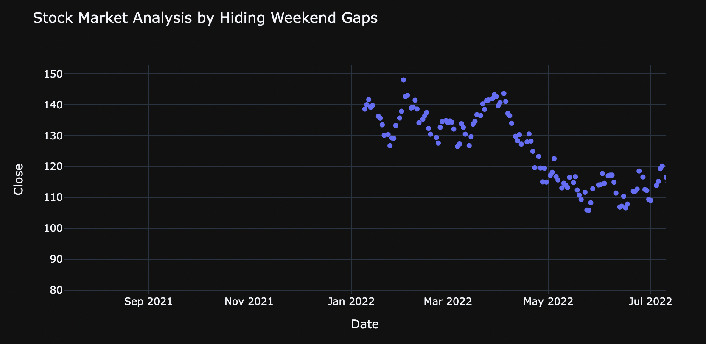

# Stock Market Analysis

Welcome to the Stock Market Analysis project! This repository provides a comprehensive guide on how to analyze the stock market using Python.

## Getting Started
***
To get started, you will need to install the following dependencies:

* yfinance
* matplotlib
* plotly

You can install these packages using pip:

`pip install yfinance matplotlib plotly
`
## Usage
***

In this project, we will be using the yfinance API from Yahoo Finance to collect real-time stock price data for Google and visualize it using various plots and interactive features. We will start by creating a candlestick chart to visualize the price movements of Google's stock over time, as well as a bar plot to analyze the stock's performance in the long term.

We will also be adding a range slider and time period selectors to allow for more in-depth analysis of the data. Additionally, we will show you how to remove records of weekend trends from your visualization, ensuring that your analysis is as accurate as possible.

By the end of this project, you will have a strong foundation in using Python for stock market analysis and be well-equipped to make informed buying and selling decisions.

## Analysis 

### Google stock data as a candlestick chart

### Google stock data as a bar chart

### Google stock data as a line chart with a range slider

### Google stock data as a line chart with time period selectors

### Google stock data as a scatter plot with hidden weekend gaps

## Resource
***
If you want to take your skills even further and learn how to predict the stock market, check out the following resources:

- Stock Prediction using Python
- Advanced Stock Analysis Techniques

## Questions?
***
If you have any questions or comments, feel free to open an issue or contact us directly. We are always happy to help!
